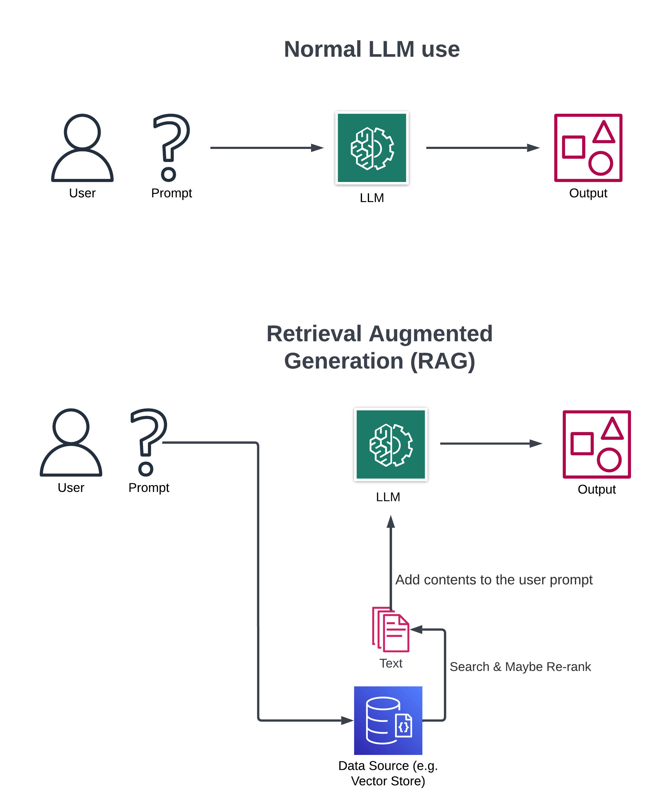
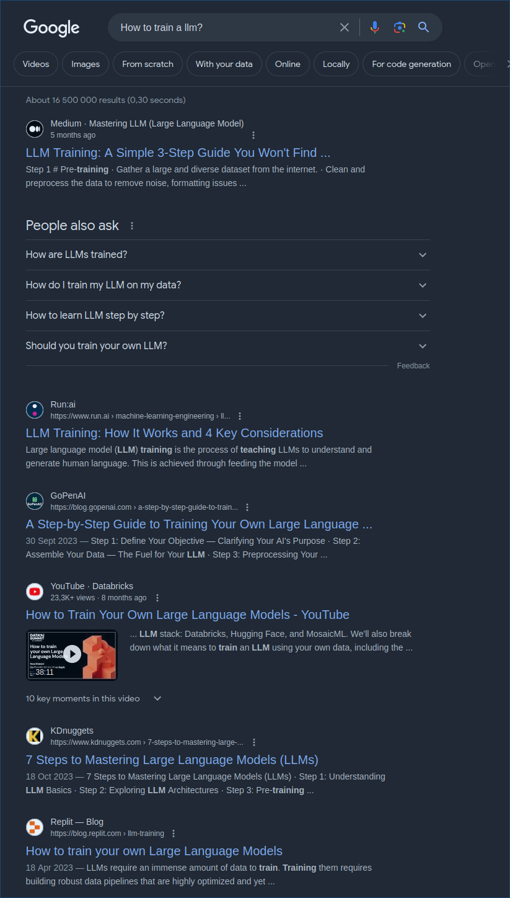
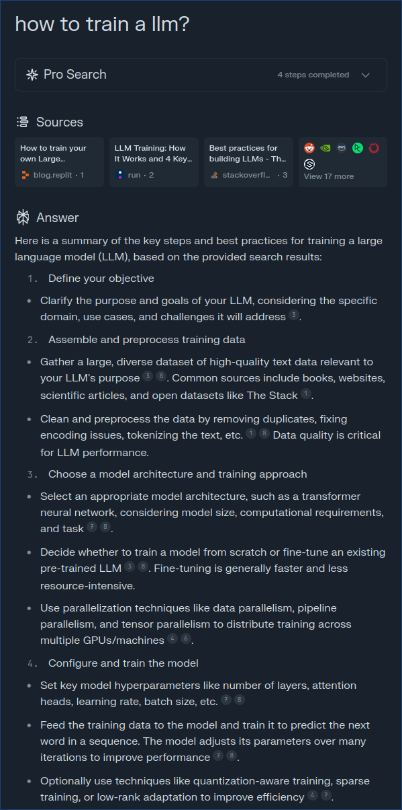
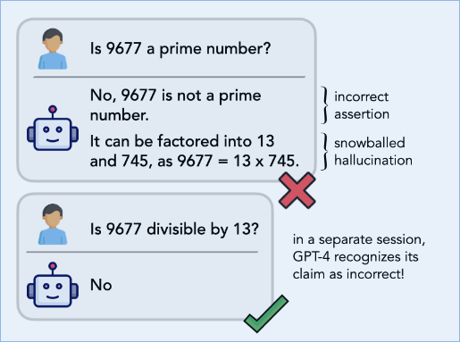
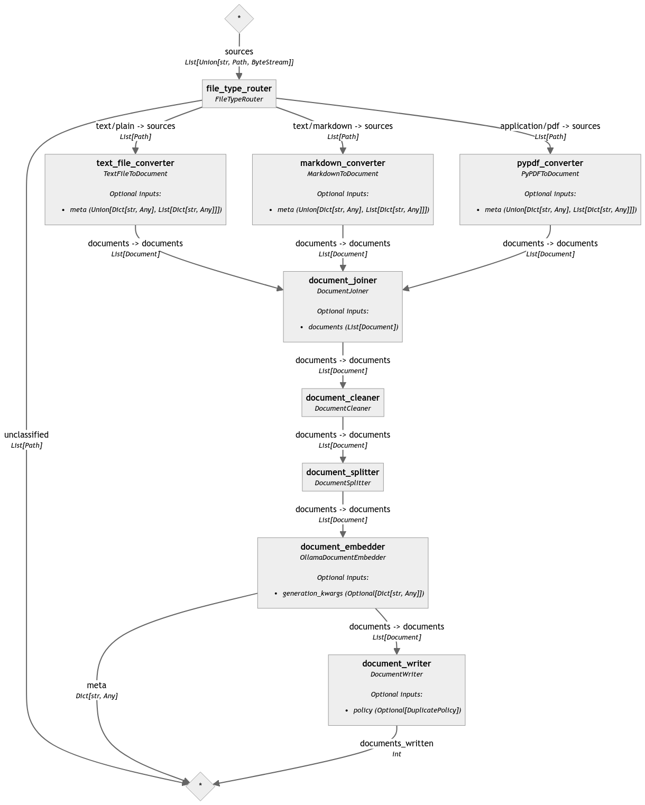
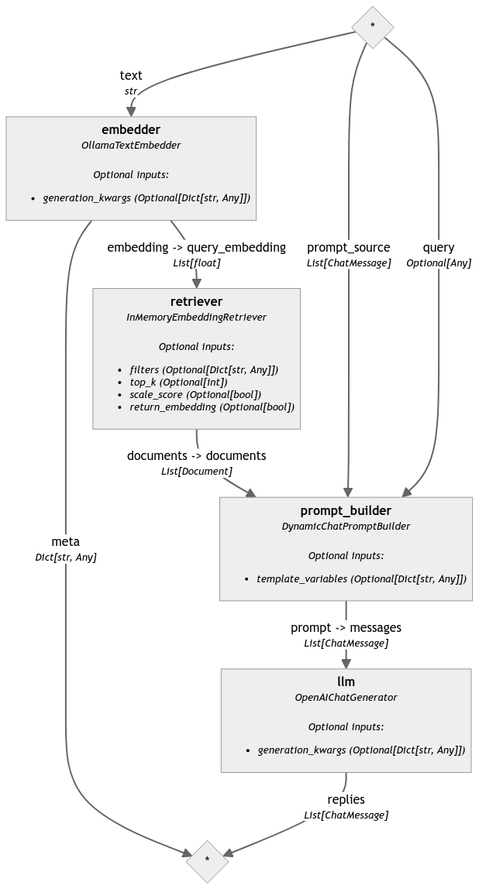

Who this talk is for: Decision makers and engineers looking for another tool in their toolbox  
Who this talk is **NOT** for: Decision makers looking for a turnkey replacement for humans in the workplace
 
## Topics:
1. What is RAG, when to use it?
2. Limitations (hallucinations and snowballing, verbosity, consistency, bad instruction-following, output format challenges)
3. Looking under the RAG: components for an end-to-end local app with code
4. Where to go from there?
5. Q&A 

## 1. What is RAG? When to use it?

- A way to use your data for context
- Work around stale data (training cutoffs) for fact retrieval
- Increase interpretability downstream 
- reduce hallucinations

#### Sounds complicated, why bother?

1. Reduce question anxiety - see "Friendly online communities"

2. Search engines in 2024 mostly serve ADs / Affiliate links / whatever was properly SEOed - RAG reduces the amount of spam filtering and can present information according to your task

Same question for [perplexity](http://perplexity.ai):

## 2. Limitations for adopting LLMs / RAG

Sounds good on paper, what are the trade-offs?

**Magnitudes more compute is required for RAG** - a search step may be optimized via caching / indexing but RAG offers limited caching options. Generation will always require compute for each request.

As engineers or decision makers it is up to you to find the profitability threshold at which it makes sense to RAG vs. relying on energy-efficient human brainpower (~20 watts on average)

**Hallucinations** - When the model makes stuff up and replies very confidently. Experienced humans learn to filter raw ideas partly based on shape - but here the shape looks the same as for a probable, well thought out response.

P(hallucination) increases most when the model has a strong incentive to be helpful, like most chat models AND knowledge for a correct response is not available to it

**Hallucination-Snowballing** [1](https://arxiv.org/abs/2305.13534) Incorrect information, once incorporated into context of a LLM response strongly biases it to stick to it for consistency, even when it knows the answer is false, once prompted. 

How to mitigate is still an open research question. Meanwhile practical approaches to add to a RAG pipeline can include:
  1. Probe with simple questions first, e.g. a prompt: `Are you aware of the ollama project? What does the name stand for?` (fact-check)
  2. Use a system prompt (=internal instructions for model behaviour which instruction-tuned models can understand) or fine-tune on your format. e.g. `You will be given a context denoted as DATA. Use only these data to answer the QUESTION. If the data are not sufficient to give a high confidence response, elaborate why and ask for clarifications. Example: ...`
  3. Check LLM output against an external validation tool, e.g. static type checker, wolfram-alpha for math, domain-specific solvers, or ask it to write code and run it, if you are fearless.
  4. **Constitutional AI** [2](https://arxiv.org/abs/2212.08073) - ask the LLM again to fact-check a previous answer candidate and correct it - this is a workaround for encoder-transformer architecture limitations, since they cannot read their own responses until done. 
  5. Use more expensive and smarter LLMs "reward models", to score the answer of cheaper and narrower LLMs and escalate to slower and larger models if the score is low

**Important:** end-user facing services (ChatGPT, Opus, Gemini) often have these built in, but APIs don't! Its up to you to de-hallucinate your API calls results

**Excess verbosity and disclaimers**:
- `certainly, please note that this kind of response may be offensive to some groups and presents a fire hazard. You should always consult a professional and follow all applicable laws, regulations and fire safety standards before cooking noodles...`

mitigate with: fine-tune on examples, specify tone of voice or conciseness in the system prompt

**Bad instruction following**
- prompt: `Return your response as json` -> `Here is the JSON: ....`
- prompt: `Format your response as github markdown` -> uses some other markdown flavor

mitigate with: fine-tune on examples

**Security/ Data Privacy implications**
- Unlike storing data in somewhat harder to access format, LLMs work with the source data directly

## 3. Looking under the RAG

What you'll need:
1. [Ollama](https://hub.docker.com/r/ollama/ollama#!) with an [embedding model](https://ollama.com/library/mxbai-embed-large) and an [instruction tuned LLM](https://ollama.com/library/command-r:35b-v0.1-q4_0) (or OpenAI credits)
2. Enough VRAM to fit local models. See `tags` on ollama and chose smaller sized ones.
3. Python 3.8 and [Haystack](https://haystack.deepset.ai/overview/intro)
4. two Haystack pipelines - one for storing documents, one for retrieving them and doing Q&A

A pipeline to embed various documents into a vector store with semantic search:

Simple document question & answer pipeline:

## 4. Where to go from there?

After basic functionality is validated to sufficient reliability:

- Start building an in-house benchmark / library of evaluations - these are your LLM regression tests
- Incorporate user feedback from the UI, for future learning -> this generates a human preferences dataset from which a reward model can be trained. Reward models can be used as judges of responses
- Build an experimentation harness to try new ideas from papers quickly
- incorporate monitoring / tracing (w&b, opentrace etc.)
- look into context-specific routers based on speed / performance trade-offs
- Consider fine-tuning a custom model from exampes, to reduce the need on instructing through system prompts

## Q&A

Feedback

mailto: lxk at droidcraft org  
X/Twitter: @TensorTemplar
